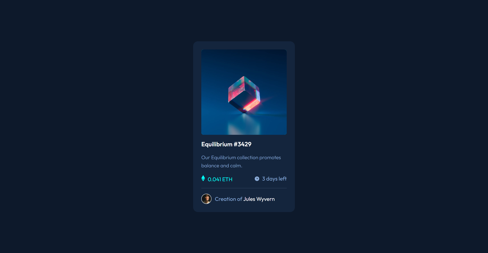

# 💻 Frontend Mentor - NFT preview card component

### Olá! 🌞

### Guia de conteúdo:

- [Visão geral](#visao-geral)
- [Processo](#processo)
  - [Tecnologias usadas](#tecnologias)
  - [O que aprendi](#o-que-aprendi)

### Visão geral
O projeto do front-end mentor é simples e pede a construção de um card, conforme prévias desktop e mobile fornecidas pelo site.

### Processo
O desafio pertence à categoria "newbie", por isso o processo também se deu de maneira simples. Eu já havia tido contato com tudo o que foi necessário para finalizá-lo.

#### Tecnologias
- HTML
- CSS

#### O que aprendi
Apesar de já ter conhecimento do CSS, analisando o código de outros usuários do Front-end Mentor que enviaram suas soluções para o site, descobri uma outra maneira de fazer o "overlay" na foto do card. Eu costumava usar a propriedade "position" com valores "relative" e "absolute" para configurar o overlay, depois ajustava o posicionamento com "top", "right", "bottom" e "left". Um dos usuários conseguiu o mesmo efeito usando "display: grid" e "place-content" (que eu ainda não conhecia). Usei essas propriedades para criar o meu efeito overlay e as repeti para centralizar o card na página.

### Meus perfis
   - [Front-end Mentor](https://www.frontendmentor.io/profile/instmi)
   - [Twitter](https://twitter.com/instmi_studies)
   - [LinkedIn](https://www.linkedin.com/in/milenaoandrade/)